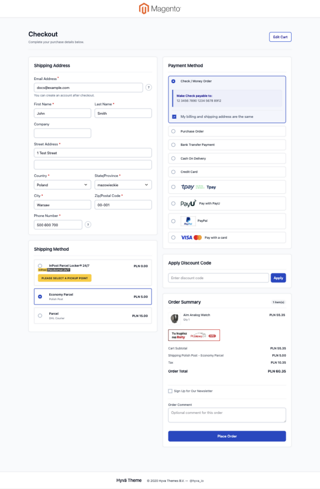

English | [Polski](README.pl.md)

# Kkkonrad Fastcheckout

## A simpler checkout for Magento 2 stores using Hyvä

Fastcheckout presents the ordering process in a responsive Hyvä interface. By
default, customers enter their address, select delivery and payment, review the
summary and place the order on one page. The store owner can instead enable
Magento's familiar two-step Shipping / Review & Payments flow without changing
the checkout design.

The module changes how Magento's standard checkout is presented, but it does
not replace the checkout engine. The store continues to use its existing
shipping methods, payment providers, taxes, discounts and Magento integrations.

## Preview



## Benefits for your store

- a choice between a fast one-page flow and Magento's familiar two-step flow,
  on desktop and mobile;
- fewer screens and interruptions while placing an order;
- in one-page mode, a “Place Order” button available from the beginning of
  checkout;
- clear validation messages with smooth scrolling to the field that needs
  attention;
- billing address set to the shipping address by default, with an option to
  enter a different one;
- shipping and payment methods updated dynamically for the current cart and
  address;
- order summary, discount code, comment, newsletter and required agreements in
  one place;
- button and loader colors inherited from the active Hyvä theme;
- the payment provider's standard flow, including redirects, card payments and
  additional security checks, remains intact.

## Shipping and payment compatibility

Fastcheckout uses the same ordering mechanisms as Magento's standard checkout.
It does not create a separate cart or its own order data store. Installed
modules continue to receive the data they expect and can add their own fields,
buttons, pickup-point maps, agreements and messages.

The module is designed to work with integrations such as InPost, Furgonetka,
DPD, PayU, Przelewy24, Tpay, PayPal, Stripe and Braintree. This is not an
automatic certification of every extension version. Before going live, test
the exact modules, versions and configurations used by the store.

Fastcheckout does not configure shipping carriers or payment providers. Those
methods must first be installed, configured and enabled correctly in Magento.

## Requirements

- Magento 2.4 (`magento/framework` 103.x);
- PHP 8.1–8.4;
- Hyvä Theme Module 1.4 or newer;
- Magento's standard Blank theme, installed automatically as a Composer
  dependency and retained only as an internal fallback while collecting the
  native checkout layout.

The module does not require Hyvä Theme Fallback, Hyvä Checkout or Magewire. The
checkout page remains on the Hyvä theme; customers never see Blank.

## Magento Admin configuration

Settings are available under:

`Stores > Configuration > Kkkonrad > Checkout`

The store administrator can:

- enable or disable Fastcheckout;
- switch between the default one-page flow and Magento's native two-step
  Shipping / Review & Payments navigation;
- show or hide the order comment, discount code and newsletter option;
- limit payment methods according to the selected shipping method;
- optionally assign guest orders to an existing customer account.

Shipping-to-payment mapping is opt-in per payment code. Once a payment code is
listed, it is available only for matching shipping rules. A payment method that
is not listed remains available, so installing a new provider does not hide it
before the administrator deliberately adds it to the mapping. Rules accept a
full shipping method, a carrier code or a prefix wildcard, for example
`tablerate_bestway`, `furgonetkapl` or `flatrate_*`.

Guest-order assignment is disabled by default. Enable it only when the store
independently verifies that the shopper owns the supplied email address.

Checkout remains available at the standard `/checkout/` URL. The legacy
`/fast-checkout/` URL redirects there automatically.

## The customer journey

In the default one-page mode:

1. The customer enters an email address and shipping address.
2. Magento loads the shipping methods available for that address.
3. Selecting a shipping method displays the applicable payment methods.
4. The customer reviews the summary, optionally applies a discount, adds a
   comment or subscribes to the newsletter, and accepts required agreements.
5. “Place Order” starts the standard flow of the selected payment provider.
6. If information is missing, checkout scrolls to the first error and explains
   what needs to be corrected.

In two-step mode, the same fields and integrations are used, but Magento first
validates and saves Shipping after the customer clicks “Next”, then opens
Review & Payments. The order summary remains available in both steps.

## Before going live

On a test copy of the store, verify:

- checkout as a guest and as a signed-in customer;
- billing address both matching and differing from the shipping address;
- every enabled shipping method, including parcel locker or pickup-point
  selection;
- every enabled payment method, especially cards and redirect payments;
- discount codes, taxes, shipping costs and the final order total;
- required and automatic checkout agreements;
- order comments and newsletter subscription;
- desktop and mobile layouts;
- returning from the payment provider and the resulting order in Magento Admin.

## Installation

Installation should be performed by the store's technical partner. The commands
below configure the package directly from its GitHub repository.

From the Magento root directory:

```bash
composer config repositories.kkkonrad-fastcheckout vcs https://github.com/kkkonrad/hyva-fast-checkout.git
composer require kkkonrad/fastcheckout:dev-master
php bin/magento module:enable Kkkonrad_Fastcheckout
php bin/magento setup:upgrade
php bin/magento cache:clean
```

For a private repository, configure SSH access or a GitHub token. A published
version tag can be used instead of `dev-master`.

### Manual app/code installation

```bash
git clone https://github.com/kkkonrad/hyva-fast-checkout.git app/code/Kkkonrad/Fastcheckout
php bin/magento module:enable Kkkonrad_Fastcheckout
php bin/magento setup:upgrade
php bin/magento cache:clean
```

### Production deployment

```bash
php bin/magento setup:di:compile
php bin/magento setup:static-content:deploy -f pl_PL en_US
```

Styles are delivered by the module and do not require adding its files to the
active theme's Tailwind configuration.

## Updating

```bash
composer update kkkonrad/fastcheckout
php bin/magento setup:upgrade
php bin/magento setup:di:compile
php bin/magento setup:static-content:deploy -f pl_PL en_US
php bin/magento cache:flush
```

After an update, repeat the most important go-live checks, especially for any
shipping or payment modules that were updated at the same time.

## Technical documentation

Architecture, validation, third-party compatibility, testing and static asset
deployment are documented in the
[technical documentation](docs/TECHNICAL.md).
