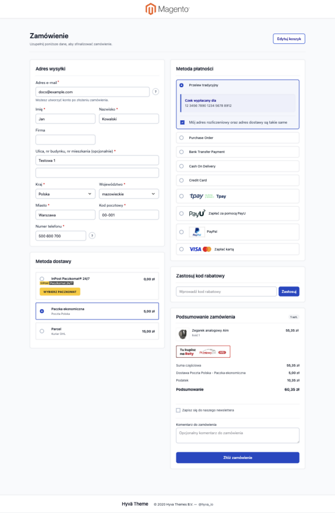

[English](README.md) | Polski

# Kkkonrad Fastcheckout

## Prostsze zamówienia w sklepach Magento 2 z motywem Hyvä

Fastcheckout porządkuje cały proces zamówienia na jednej, responsywnej stronie.
Klient może uzupełnić adres, wybrać dostawę i płatność, sprawdzić podsumowanie
oraz złożyć zamówienie bez przechodzenia między kolejnymi krokami.

Moduł zmienia prezentację standardowego checkoutu Magento, ale nie zastępuje
jego silnika. Dzięki temu sklep nadal korzysta z własnych metod dostawy,
płatności, podatków, rabatów i integracji zainstalowanych w Magento.

## Podgląd



## Co zyskuje sklep

- cały proces zamówienia na jednej stronie, na komputerach i urządzeniach
  mobilnych;
- mniej przełączania między ekranami podczas składania zamówienia;
- przycisk „Złóż zamówienie” widoczny od początku procesu;
- jasne komunikaty walidacyjne i płynne przewijanie do miejsca wymagającego
  poprawy;
- adres rozliczeniowy domyślnie zgodny z adresem dostawy, z możliwością jego
  zmiany;
- dynamiczną listę dostaw i płatności zależną od aktualnego koszyka i adresu;
- podsumowanie zamówienia, kod rabatowy, komentarz, newsletter i wymagane zgody
  w jednym miejscu;
- kolorystykę przycisków i loaderów dziedziczoną z aktywnego motywu Hyvä;
- zachowanie standardowego procesu danego operatora, w tym przekierowań,
  płatności kartą i dodatkowych zabezpieczeń.

## Zgodność z dostawami i płatnościami

Fastcheckout korzysta z tych samych mechanizmów składania zamówienia co
standardowe Magento. Nie tworzy osobnego koszyka ani własnego magazynu danych
zamówienia. Zainstalowane moduły nadal otrzymują oczekiwane dane i mogą dodawać
własne pola, przyciski, mapy punktów odbioru, zgody oraz komunikaty.

Architektura modułu jest przygotowana do współpracy między innymi z integracjami
typu InPost, Furgonetka, DPD, PayU, Przelewy24, Tpay, PayPal, Stripe i Braintree.
Nie oznacza to automatycznej certyfikacji każdej wersji tych rozszerzeń — przed
uruchomieniem produkcyjnym należy przetestować dokładnie te metody i konfiguracje,
których używa dany sklep.

Fastcheckout nie konfiguruje operatorów dostawy ani płatności. Metody muszą być
najpierw poprawnie zainstalowane, skonfigurowane i aktywowane w Magento.

## Wymagania

- Magento 2.4 (`magento/framework` 103.x);
- PHP 8.1–8.4;
- Hyvä Theme Module 1.4 lub nowszy;
- standardowy motyw Magento Luma, instalowany automatycznie jako zależność
  Composer i używany wyłącznie wewnętrznie do budowy layoutu checkoutu.

Moduł nie wymaga Hyvä Theme Fallback, Hyvä Checkout ani Magewire. Strona
checkoutu pozostaje w motywie Hyvä — Luma nie jest wyświetlana klientowi.

## Konfiguracja w panelu Magento

Ustawienia znajdują się w:

`Sklepy > Konfiguracja > Kkkonrad > Checkout`

Administrator sklepu może:

- włączyć lub wyłączyć Fastcheckout;
- pokazać albo ukryć pole komentarza, kod rabatowy i zapis do newslettera;
- ograniczyć dostępne płatności zależnie od wybranej metody dostawy;
- opcjonalnie przypisywać zamówienia gości do istniejącego konta klienta.

Przypisywanie zamówień gościa jest domyślnie wyłączone. Należy je włączyć tylko
wtedy, gdy sklep niezależnie potwierdza, że kupujący jest właścicielem podanego
adresu e-mail.

Checkout pozostaje dostępny pod standardowym adresem `/checkout/`. Stary adres
`/fast-checkout/` przekierowuje do niego automatycznie.

## Jak wygląda proces dla klienta

1. Klient podaje adres e-mail i adres dostawy.
2. Magento pobiera dostępne dla tego adresu metody dostawy.
3. Po wyborze dostawy pojawiają się właściwe metody płatności.
4. Klient sprawdza podsumowanie, opcjonalnie używa rabatu, dodaje komentarz lub
   zapisuje się do newslettera i akceptuje wymagane zgody.
5. Przycisk „Złóż zamówienie” uruchamia standardowy proces wybranego operatora
   płatności.
6. Jeżeli czegoś brakuje, checkout przewija ekran do pierwszego błędu i wskazuje,
   co należy poprawić.

## Checklista przed uruchomieniem

Na kopii testowej sklepu warto sprawdzić:

- zakup jako gość oraz jako zalogowany klient;
- adres rozliczeniowy taki sam i inny niż adres dostawy;
- każdą aktywną metodę dostawy, w tym wybór paczkomatu lub punktu odbioru;
- każdą aktywną płatność, szczególnie karty i płatności z przekierowaniem;
- kod rabatowy, podatki, koszty dostawy i końcową kwotę zamówienia;
- wymagane i automatyczne zgody checkoutu;
- komentarz do zamówienia oraz zapis do newslettera;
- widok desktopowy i mobilny;
- powrót z bramki płatniczej oraz poprawne utworzenie zamówienia w panelu.

## Instalacja

Instalację powinien wykonać opiekun techniczny sklepu. Pakiet nie jest dostępny
na Packagist i jest pobierany bezpośrednio z repozytorium GitHub.

W katalogu głównym Magento:

```bash
composer config repositories.kkkonrad-fastcheckout vcs https://github.com/kkkonrad/hyva-fast-checkout.git
composer require kkkonrad/fastcheckout:dev-master
php bin/magento module:enable Kkkonrad_Fastcheckout
php bin/magento setup:upgrade
php bin/magento cache:clean
```

Dla prywatnego repozytorium należy skonfigurować dostęp SSH lub token GitHub.
Zamiast `dev-master` można użyć opublikowanego tagu wersji.

### Instalacja ręczna w app/code

```bash
git clone https://github.com/kkkonrad/hyva-fast-checkout.git app/code/Kkkonrad/Fastcheckout
php bin/magento module:enable Kkkonrad_Fastcheckout
php bin/magento setup:upgrade
php bin/magento cache:clean
```

### Wdrożenie produkcyjne

```bash
php bin/magento setup:di:compile
php bin/magento setup:static-content:deploy -f pl_PL en_US
```

Style są dostarczane przez moduł i nie wymagają dodawania jego plików do
konfiguracji Tailwind aktywnego motywu.

## Aktualizacja

```bash
composer update kkkonrad/fastcheckout
php bin/magento setup:upgrade
php bin/magento setup:di:compile
php bin/magento setup:static-content:deploy -f pl_PL en_US
php bin/magento cache:flush
```

Po aktualizacji należy ponownie wykonać najważniejsze scenariusze z checklisty,
zwłaszcza dla modułów dostawy i płatności, które również zostały zaktualizowane.

## Dokumentacja techniczna

Szczegóły architektury, walidacji, zgodności z rozszerzeniami, testów oraz
publikowania plików statycznych znajdują się w
[dokumentacji technicznej](docs/TECHNICAL.pl.md).
